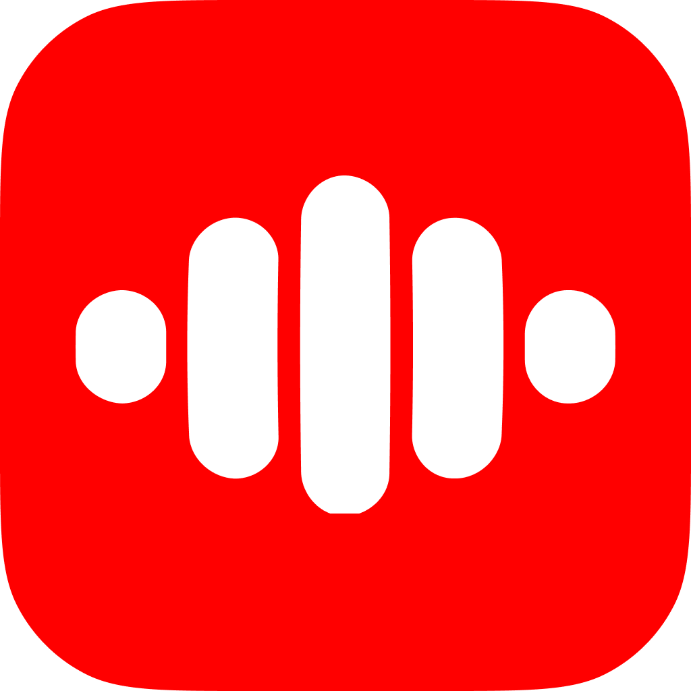

<h1 align="center">
   
  Ten Ten iOS Engineer Interview
   
</h1>

  

 

There is a number of `TODO` and `FIXME` throughout the code that you must implement or fix.

## What should I do?

There are a few tasks to perform:

- Test your animation skills by implementing a custom `ConnectionIndicator`
- Test your `async` / `await` skills by implementing an `ExecutionQueue`
- Test your Swift & SwiftUI knowledge by implementing a set of small – but tricky, components
- Implement a high performance friendlist
- Implement a commonly found 'Settings' page, following a Figma design

## Important notes

- Please, do not fork your solution in a public repository
- You must **not** change the content of `ios-interview-test/`
- This test is designed to challenge your knowledge of the Swift ecosystem, Swift itself and SwiftUI
- Feel free to add any amount of testing, ...etc
- It's okay if you don't do it all !

## Spontaneous applications

Interested in working with us? We're always looking for talents!

Shoot us an email at

<h3 align="center">
   
  

    *Kkrshhtzz*
   
    Over! ✌️
</h3>
